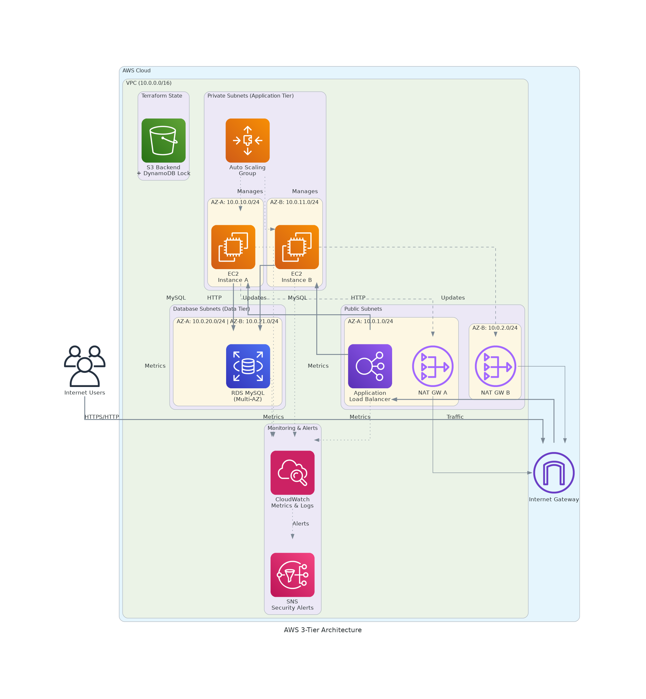

# AWS 3-Tier Architecture Implementation Plan

## Project Overview
Implementation of a basic AWS 3-tier architecture using Terraform for infrastructure as code.

## Architecture Diagram

### Visual Architecture Diagram


*Generated architecture diagram showing the complete AWS 3-tier infrastructure with VPC, subnets, load balancer, auto scaling group, and RDS database.*

### Network Flow Details


### Network Flow
1. **Inbound Traffic**: Users → Internet Gateway → ALB → EC2 Instances
2. **Database Access**: EC2 Instances → RDS (Private Communication)
3. **Outbound Traffic**: EC2 Instances → NAT Gateway → Internet Gateway
4. **Security**: Each layer protected by dedicated Security Groups

## Architecture Components

### Tier 1: Presentation Layer (Load Balancer)
- **Application Load Balancer (ALB)**
  - Internet-facing load balancer
  - HTTP/HTTPS listeners
  - Target groups for EC2 instances
  - Health checks configuration

### Tier 2: Application Layer (EC2 Instances)
- **EC2 Instances**
  - Auto Scaling Group for high availability
  - Launch Template with user data
  - Security groups for application access
  - Multiple availability zones

### Tier 3: Data Layer (RDS)
- **RDS Database**
  - Multi-AZ deployment for high availability
  - Automated backups
  - Security groups for database access
  - Subnet groups for network isolation

## Implementation Phases

### Phase 1: Network Foundation
1. **VPC and Networking**
   - Create VPC with appropriate CIDR
   - Public subnets for ALB (2 AZs minimum)
   - Private subnets for EC2 instances (2 AZs minimum)
   - Database subnets for RDS (2 AZs minimum)
   - Internet Gateway for public access
   - NAT Gateways for private subnet internet access
   - Route tables configuration

### Phase 2: Security Configuration
2. **Security Groups**
   - ALB security group (HTTP/HTTPS from internet)
   - EC2 security group (HTTP from ALB only)
   - RDS security group (MySQL/PostgreSQL from EC2 only)
   - Bastion host security group (SSH access)

3. **IAM Roles and Policies**
   - EC2 instance role for AWS service access
   - Service-linked roles for Auto Scaling
   - Policies following least privilege principle

### Phase 3: Core Infrastructure
4. **Database Layer**
   - RDS subnet group
   - RDS parameter group (if custom parameters needed)
   - RDS instance with encryption
   - Database security group

5. **Application Layer**
   - Launch Template for EC2 instances
   - Auto Scaling Group configuration
   - Target Group for ALB
   - Security group for EC2 instances

6. **Load Balancer Layer**
   - Application Load Balancer
   - ALB listeners and rules
   - Target group attachment
   - Security group for ALB

### Phase 4: Monitoring and Maintenance
7. **Monitoring Setup**
   - CloudWatch alarms for key metrics
   - SNS topics for notifications
   - Log groups for application logs

8. **Backup and Recovery**
   - RDS automated backups
   - EC2 AMI creation schedule
   - Disaster recovery procedures

## File Structure Plan
```
├── main.tf                 # Main configuration
├── variables.tf           # Input variables
├── outputs.tf            # Output values
├── versions.tf           # Provider versions
├── modules/
│   ├── vpc/              # VPC and networking
│   ├── security/         # Security groups and IAM
│   ├── alb/              # Application Load Balancer
│   ├── ec2/              # Auto Scaling Group and Launch Template
│   └── rds/              # RDS database
├── environments/
│   ├── dev/              # Development environment
│   ├── staging/          # Staging environment
│   └── prod/             # Production environment
└── scripts/
    ├── user-data.sh      # EC2 user data script
    └── db-init.sql       # Database initialization
```

## Resource Naming Convention
- Environment prefix: `[env]-[project]-[resource]`
- Example: `dev-aws-study-vpc`, `prod-aws-study-alb`

## Testing Strategy
1. **Syntax Validation**: `terraform validate`
2. **Plan Review**: `terraform plan` for each environment
3. **Development Testing**: Deploy to dev environment first
4. **Connectivity Testing**: Verify ALB → EC2 → RDS connectivity
5. **Load Testing**: Basic load testing on ALB
6. **Security Testing**: Verify security group rules

## Success Criteria
- [ ] All resources deployed successfully
- [ ] Web application accessible via ALB
- [ ] Database connectivity from application
- [ ] Auto Scaling Group responds to load
- [ ] Monitoring and alarms functional
- [ ] Security groups properly configured
- [ ] All environments (dev/staging/prod) deployable

## Next Steps After Implementation
1. Set up CI/CD pipeline
2. Implement application monitoring
3. Add SSL/TLS certificates
4. Configure log aggregation
5. Implement backup and disaster recovery testing