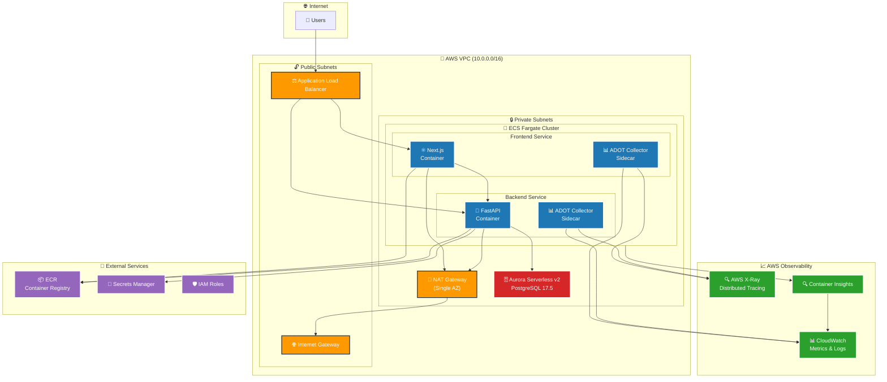

# ADOT Study Environment Architecture

## Overview
This document outlines the architecture for studying AWS Distro for OpenTelemetry (ADOT) in a realistic microservices environment.

## Cloud Architecture Diagram

## Architecture Flow

1. **User Traffic**: Internet users access the application through the ALB
2. **Load Balancing**: ALB distributes traffic across multiple AZs to ECS services
3. **Service Communication**: Frontend (Next.js) communicates with Backend (FastAPI)
4. **Database Access**: Backend services query Aurora Serverless v2 PostgreSQL
5. **Telemetry Collection**: ADOT sidecars collect traces, metrics, and logs
6. **Observability**: Telemetry data flows to X-Ray and CloudWatch for analysis

## Architecture Components

### 1. Application Load Balancer (ALB)
- **Purpose**: Entry point for all traffic, distributes requests between frontend and backend services
- **Configuration**: 
  - Public-facing
  - SSL/TLS termination
  - Path-based routing:
    - `/` → Frontend ECS
    - `/api/*` → Backend ECS
    - `/health` → Health check endpoints

### 2. Frontend ECS Service (Next.js)
- **Technology**: Next.js (React-based)
- **Deployment**: ECS Fargate
- **Purpose**: Serves the web interface, demonstrates frontend observability
- **ADOT Integration**:
  - Browser-side telemetry collection
  - Real User Monitoring (RUM)
  - Frontend performance metrics

### 3. Backend ECS Service (FastAPI)
- **Technology**: FastAPI (Python)
- **Deployment**: ECS Fargate
- **Purpose**: REST API backend, demonstrates backend observability
- **ADOT Integration**:
  - HTTP request tracing
  - Database query tracing
  - Custom metrics and logs

### 4. Database Layer
- **Technology**: Aurora Serverless v2 (PostgreSQL)
- **Purpose**: Data persistence, demonstrates database observability
- **ADOT Integration**:
  - Database query performance monitoring
  - Connection pool metrics

### 5. Observability Stack
- **ADOT Collector**: Centralized telemetry collection
- **AWS X-Ray**: Distributed tracing
- **CloudWatch**: Metrics and logs
- **Prometheus**: Custom metrics (optional)

## Data Flow

1. **User Request** → ALB → Frontend ECS
2. **API Request** → ALB → Backend ECS → Aurora Serverless
3. **Telemetry Data** → ADOT Collector → AWS X-Ray/CloudWatch

## Network Architecture

### VPC Structure
- **Public Subnets**: ALB (2 AZs required for ALB)
- **Private Subnets**: ECS Services, Aurora Serverless (2 AZs)
- **NAT Gateway**: Single NAT Gateway in one AZ (cost optimization)
- **Security Groups**: Restricted access between components

### Security
- ALB: Public internet access (HTTPS only) across 2 AZs
- ECS: Private subnets, ALB access only
- Aurora: Private subnets, ECS access only

## Observability Goals

### Metrics
- Application performance (response time, throughput)
- Infrastructure utilization (CPU, memory, network)
- Database performance (query time, connections)
- Custom business metrics

### Traces
- End-to-end request tracing
- Database query tracing
- Inter-service communication

### Logs
- Application logs (structured JSON)
- Access logs (ALB, ECS)
- Database logs (slow queries, errors)

## ADOT Configuration Areas

### 1. Frontend (Next.js)
- Browser instrumentation
- User interaction tracking
- Performance monitoring

### 2. Backend (FastAPI)
- Automatic instrumentation
- Custom spans and metrics
- Database instrumentation

### 3. Infrastructure
- ECS container metrics
- ALB metrics
- Aurora metrics

## Study Focus Areas

1. **Auto-instrumentation**: Minimal code changes for observability
2. **Custom instrumentation**: Adding business-specific metrics
3. **Correlation**: Connecting frontend and backend traces
4. **Performance impact**: Overhead of telemetry collection
5. **Configuration management**: ADOT collector configuration
6. **Data export**: Multiple backend destinations